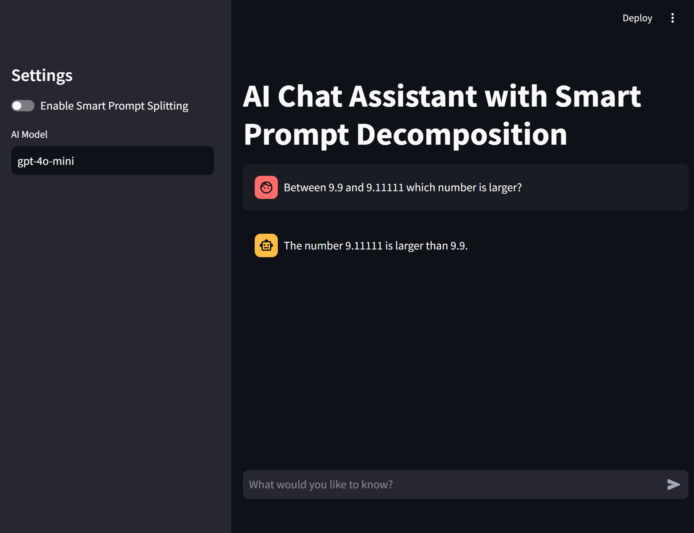
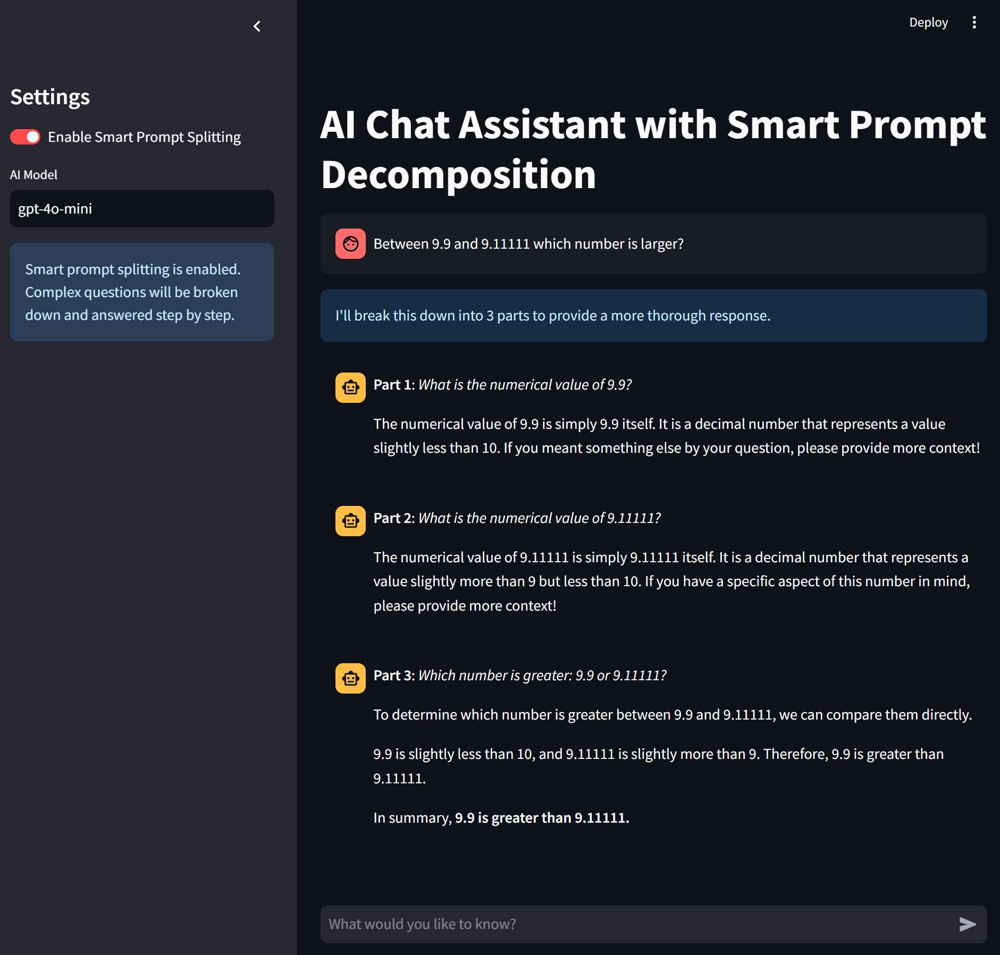

# AI Chat Assistant with Smart Prompt Decomposition

An intelligent chat assistant that can break down complex queries into simpler sub-queries for more comprehensive and structured responses.

## Features

- Smart prompt decomposition for complex queries
- Context-aware responses
- Support for code blocks with syntax highlighting
- LaTeX rendering support
- Customizable AI model selection
- Toggle between normal chat and smart decomposition modes

## Screenshots

### Without Prompt Splitting


### With Smart Prompt Splitting


## Installation

1. Clone the repository

2. Install the required dependencies:
```bash
pip install -r requirements.txt
```

This will install:
- streamlit (>= 1.31.0)
- litellm (>= 1.30.7)
- python-dotenv (>= 1.0.1)
- typing (>= 3.7.4.3)

## API Configuration

Before using the application, you need to configure your LLM API keys. The application uses LiteLLM which supports various LLM providers.

1. Create a `.env` file in the root directory

2. Add your API keys based on your preferred LLM provider:
```env
# OpenAI
OPENAI_API_KEY=your_openai_api_key

# Anthropic
ANTHROPIC_API_KEY=your_anthropic_api_key

# Azure OpenAI
AZURE_API_KEY=your_azure_api_key
AZURE_API_BASE=your_azure_endpoint
AZURE_API_VERSION=your_azure_api_version
```

3. The application will automatically load the appropriate API key based on the selected model in the sidebar.

## Usage

1. Start the application:
```bash
streamlit run app.py
```

2. The application will open in your default web browser

3. Use the sidebar to:
   - Toggle Smart Prompt Splitting
   - Configure the AI model

4. Enter your questions in the chat input at the bottom

## Features in Detail

### Smart Prompt Decomposition
When enabled, complex queries are automatically broken down into smaller, logically connected sub-queries. The assistant processes each sub-query while maintaining context, resulting in more thorough and structured responses.

### Markdown and Code Support
The assistant supports:
- Code blocks with syntax highlighting
- LaTeX equations (both inline and display mode)
- Regular markdown formatting

### Context Awareness
The system maintains context between sub-queries, ensuring that responses build upon previous information for more coherent and comprehensive answers.

## Requirements

- Python 3.x
- Dependencies listed in requirements.txt
- Internet connection for AI model access

## Note

Make sure to configure your AI model settings in the sidebar for optimal performance. The smart prompt splitting feature is particularly useful for complex, multi-part questions that require detailed explanations.